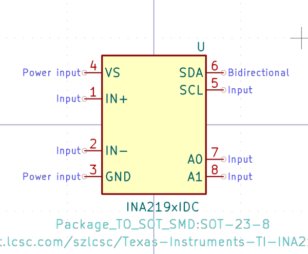
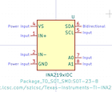

# OOMP Symbol  
## analog_adc_extra_ina219xidc  by arturo182  
  
oomp key: oomp_arturo182_analog_adc_extra_ina219xidc  
  
source repo at: [https://github.com/arturo182/kicad-library](https://github.com/arturo182/kicad-library)  
## Symbol  
  
  
| name | value | 
| --- | --- | 
| symbol name | Analog_ADC_Extra | 
| library name | Analog_ADC_Extra | 
| oomp key | oomp_arturo182_analog_adc_extra_ina219xidc | 
| oomp bot github | https://github.com/oomlout/oomlout_oomp_symbol_bot/tree/main/arturo182_analog_adc_extra_ina219xidc/working | 
## Images  
  
  
