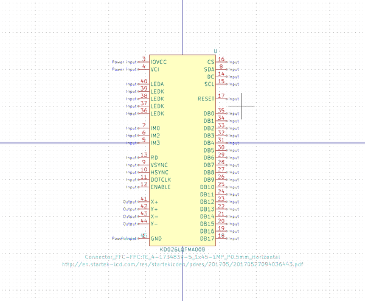

# OOMP Symbol  
## display_graphic_extra_lvxxxnb_f07  by arturo182  
  
oomp key: oomp_arturo182_display_graphic_extra_lvxxxnb_f07  
  
source repo at: [https://github.com/arturo182/kicad-library](https://github.com/arturo182/kicad-library)  
## Symbol  
  
  
| name | value | 
| --- | --- | 
| symbol name | Display_Graphic_Extra | 
| library name | Display_Graphic_Extra | 
| oomp key | oomp_arturo182_display_graphic_extra_lvxxxnb_f07 | 
| oomp bot github | https://github.com/oomlout/oomlout_oomp_symbol_bot/tree/main/arturo182_display_graphic_extra_lvxxxnb_f07/working | 
## Images  
