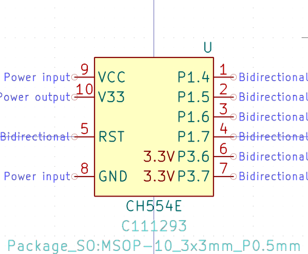
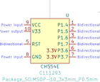

# OOMP Symbol  
## mcu_wch_ch554e  by arturo182  
  
oomp key: oomp_arturo182_mcu_wch_ch554e  
  
source repo at: [https://github.com/arturo182/kicad-library](https://github.com/arturo182/kicad-library)  
## Symbol  
  
  
| name | value | 
| --- | --- | 
| symbol name | MCU_WCH | 
| library name | MCU_WCH | 
| oomp key | oomp_arturo182_mcu_wch_ch554e | 
| oomp bot github | https://github.com/oomlout/oomlout_oomp_symbol_bot/tree/main/arturo182_mcu_wch_ch554e/working | 
## Images  
  
  
