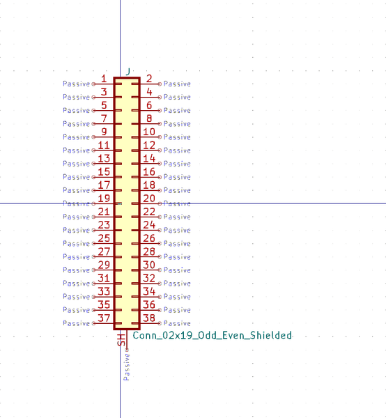
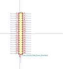

# OOMP Symbol  
## connector_generic_shielded_conn_02x19_odd_even_shielded  by arturo182  
  
oomp key: oomp_kicad_connector_generic_shielded_conn_02x19_odd_even_shielded  
  
source repo at: [https://gitlab.com/kicad/libraries/kicad-symbols](https://gitlab.com/kicad/libraries/kicad-symbols)  
## Symbol  
  
  
| name | value | 
| --- | --- | 
| symbol name | Connector_Generic_Shielded | 
| library name | Connector_Generic_Shielded | 
| oomp key | oomp_kicad_connector_generic_shielded_conn_02x19_odd_even_shielded | 
| oomp bot github | https://github.com/oomlout/oomlout_oomp_symbol_bot/tree/main/kicad_connector_generic_shielded_conn_02x19_odd_even_shielded/working | 
## Images  
  
  
