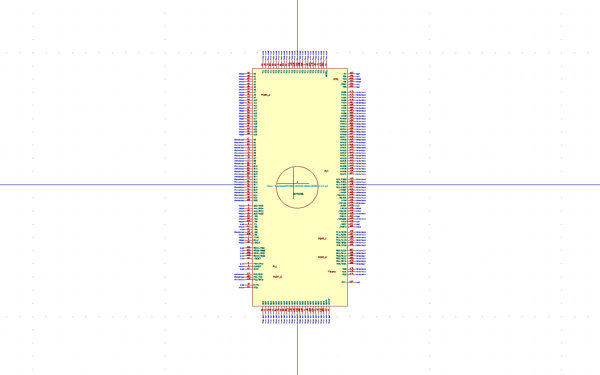
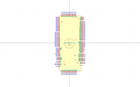

# OOMP Symbol  
## dsp_motorola_dsp56301  by arturo182  
  
oomp key: oomp_kicad_dsp_motorola_dsp56301  
  
source repo at: [https://gitlab.com/kicad/libraries/kicad-symbols](https://gitlab.com/kicad/libraries/kicad-symbols)  
## Symbol  
  
  
| name | value | 
| --- | --- | 
| symbol name | DSP_Motorola | 
| library name | DSP_Motorola | 
| oomp key | oomp_kicad_dsp_motorola_dsp56301 | 
| oomp bot github | https://github.com/oomlout/oomlout_oomp_symbol_bot/tree/main/kicad_dsp_motorola_dsp56301/working | 
## Images  
  
  
