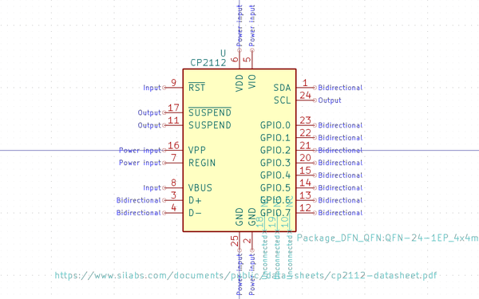
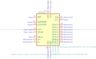

# OOMP Symbol  
## interface_usb_cy7c65215_32ltxi  by arturo182  
  
oomp key: oomp_kicad_interface_usb_cy7c65215_32ltxi  
  
source repo at: [https://gitlab.com/kicad/libraries/kicad-symbols](https://gitlab.com/kicad/libraries/kicad-symbols)  
## Symbol  
  
  
| name | value | 
| --- | --- | 
| symbol name | Interface_USB | 
| library name | Interface_USB | 
| oomp key | oomp_kicad_interface_usb_cy7c65215_32ltxi | 
| oomp bot github | https://github.com/oomlout/oomlout_oomp_symbol_bot/tree/main/kicad_interface_usb_cy7c65215_32ltxi/working | 
## Images  
  
  
