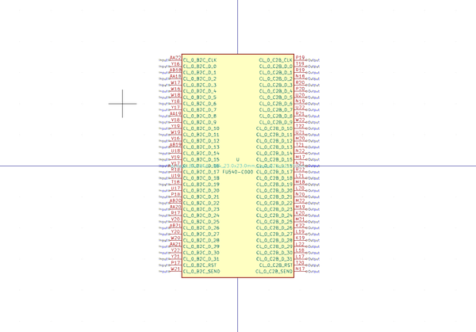

# OOMP Symbol  
## mcu_sifive_fu540_c000  by arturo182  
  
oomp key: oomp_kicad_mcu_sifive_fu540_c000  
  
source repo at: [https://gitlab.com/kicad/libraries/kicad-symbols](https://gitlab.com/kicad/libraries/kicad-symbols)  
## Symbol  
  
  
| name | value | 
| --- | --- | 
| symbol name | MCU_SiFive | 
| library name | MCU_SiFive | 
| oomp key | oomp_kicad_mcu_sifive_fu540_c000 | 
| oomp bot github | https://github.com/oomlout/oomlout_oomp_symbol_bot/tree/main/kicad_mcu_sifive_fu540_c000/working | 
## Images  
